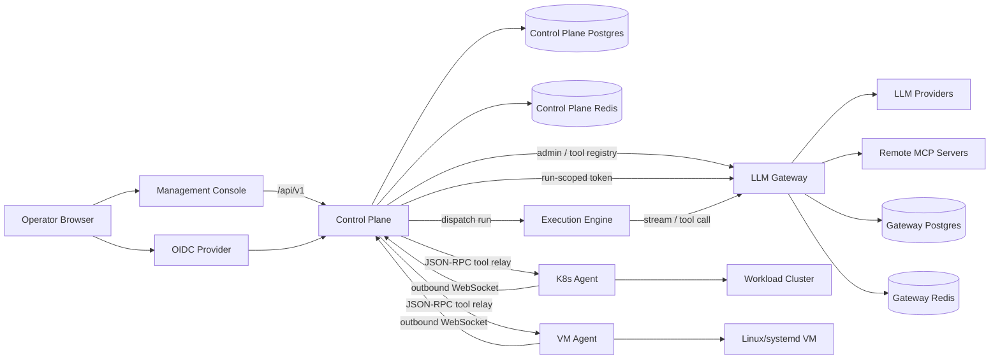

# AcornOps System Architecture

This is the canonical whole-platform architecture map for developers working in
the AcornOps workspace. Component-level internals remain in each child
repository's `ARCHITECTURE.md`; deployment mechanics live in
`acornops-deployment/docs/deployment-architecture.md`.

## Developer Reading Path

1. Read this file to understand how the platform fits together.
2. Use `workspace.yaml` to find the local path and validation command for each
   repository.
3. Read the affected component repository's `README.md`, `AGENTS.md`, and
   `ARCHITECTURE.md` before changing implementation code.
4. Read `acornops-deployment/docs/deployment-architecture.md` when the question
   is about Compose, Kubernetes, ingress, release wiring, or operating the
   assembled stack.

## Logical Architecture

## How The Pieces Fit

The management console is the operator-facing browser application. It talks to
the control plane through `/api/v1` and depends on the control plane for
authentication state, workspace and target APIs, run orchestration, and
agent-backed operations.

The control plane is the public application boundary. It owns authenticated
HTTP APIs, session handling, workspace state, target registration, run state,
agent WebSocket ownership, and cross-service orchestration. It persists durable
application state in Postgres and uses Redis for runtime coordination such as
agent ownership, fanout, and scheduler leases.

The execution engine is the run worker. The control plane dispatches work to it;
the execution engine drives the run lifecycle, streams reasoning/tool events,
and reports state transitions back to the control plane.

The LLM gateway is the model and tool broker. It normalizes provider calls,
enforces gateway policy, brokers MCP tool calls, stores gateway metadata, and
connects to remote MCP servers and external LLM providers. The control plane
uses gateway admin APIs to register tools and issues run-scoped credentials for
execution-time access.

The k8s agent and VM agent are outbound-only target agents. They connect back to
the control plane over WebSocket, publish target snapshots, and receive
JSON-RPC tool calls relayed by the control plane. The k8s agent operates inside
workload clusters; the VM agent runs as a Linux/systemd process for VM targets.

The deployment repository assembles these services into runnable topologies. It
does not own component runtime code; it owns Compose and Kubernetes wiring,
environment templates, ingress/proxy behavior, release compatibility metadata,
and operator runbooks.

## Primary Runtime Flows

### Operator Session

1. The operator opens the management console.
2. The console sends API requests to the control plane.
3. The operator authenticates through the configured OIDC provider.
4. The control plane establishes the application session and serves workspace,
   target, run, and configuration APIs to the console.

### Run Execution

1. The console requests a run through the control plane.
2. The control plane validates workspace, target, and session boundaries.
3. The control plane dispatches the run to the execution engine.
4. The execution engine calls the LLM gateway for model streaming and tool
   execution.
5. The execution engine posts run events and terminal state back to the control
   plane.
6. The console reads live or replayed run state from the control plane.

### Agent Tooling

1. A k8s or VM agent connects outbound to the control plane WebSocket endpoint.
2. The agent publishes target identity, health, capabilities, and snapshots.
3. The control plane records target state and routes target-scoped tool calls.
4. The agent executes allowed JSON-RPC tools against its local target.
5. Tool results flow back through the control plane to the requesting run or UI.

### Gateway Tooling

1. The control plane registers gateway-visible tools and MCP servers through
   gateway admin APIs.
2. The execution engine calls the gateway with run-scoped credentials.
3. The gateway applies policy, calls configured LLM providers, and brokers MCP
   tool calls when the model requests tools.
4. Gateway stream events return to the execution engine and then back to the
   control plane as run events.

## Public And Internal Boundaries

Production public route hostnames:

- `console.acornops.dev/` serves the management console.
- `api.acornops.dev/api` serves the control plane API and agent WebSocket route.
- `console.acornops.dev/api` remains available for same-origin browser session flows.
- `docs.acornops.dev/` serves the public documentation site.
- Root `acornops.dev` is reserved outside the platform API surface.

Internal-only services:

- execution-engine
- llm-gateway
- Postgres
- Redis

## Repository Ownership

- `management-console`: browser UI and nginx production image.
- `control-plane`: auth, workspaces, sessions, run state, agent
  bridge, and orchestration API.
- `execution-engine`: run worker and durable execution callbacks.
- `llm-gateway`: LLM provider gateway, MCP broker, secrets backend,
  and gateway policy.
- `k8s-agent`: workload-cluster agent and agent Helm chart.
- `vm-agent`: read-only Linux/systemd VM agent, packaging, and local
  mock collectors.
- `acornops-deployment`: full-stack deployment tracks, platform Helm chart,
  runbooks, and release matrix.
- `docs-website`: public documentation site.

## Deployment Tracks

The system can be assembled in several ways, all owned by
`acornops-deployment`:

- local full-stack development with source bind mounts and local support
  services
- Docker-on-VM production deployment
- central Kubernetes platform deployment
- workload-cluster k8s-agent rollout
- Linux/systemd VM agent installation

Use `acornops-deployment/docs/deployment-architecture.md` for topology,
ingress, state, HA, and operator details for those tracks.
